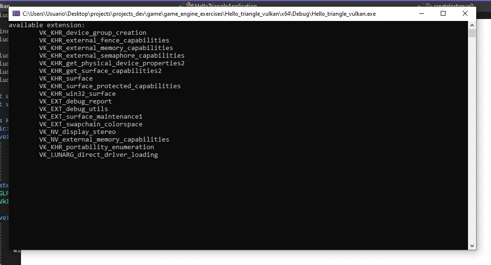

# Hello_triangle_vulkan
## Instancia
### Creando la instancia
La instancia es el enlace entre tu aplicación y la librería de Vulkan. Lo primero será llamar a `createInstance()` desde `initVulkan()`.

```c++
void initVulkan(){
	createInstance();
}
```
Luego añadimos un miembro que albergará el *handle* de la instancia:
```c++
VkInstance instance;
```

En la definición del método `createInstance` rellenamos un *struct* con datos que otorgan información al *driver* para optimizar nuestra aplicación.

```c++
void createInstance() {
		VkApplicationInfo appInfo{};
		appInfo.sType = VK_STRUCTURE_TYPE_APPLICATION_INFO;
		appInfo.pApplicationName = "Hello Triangle";
		appInfo.applicationVersion = VK_MAKE_VERSION(1, 0, 0);
		appInfo.pEngineName = "No Engine";
		appInfo.engineVersion = VK_MAKE_VERSION(1, 0, 0);
		appInfo.apiVersion = VK_API_VERSION_1_0;
```
Añadimos otro *struct* que le dice al *driver* qué extensiones globales y capas de validación queremos usar:
```c++
VkInstanceCreateInfo createInfo{};
		createInfo.sType = VK_STRUCTURE_TYPE_INSTANCE_CREATE_INFO;
		createInfo.pApplicationInfo = &appInfo;

		uint32_t glfwExtensionCount = 0;
		const char** glfwExtensions;

		glfwExtensions = glfwGetRequiredInstanceExtensions(&glfwExtensionCount);

		createInfo.enabledExtensionCount = glfwExtensionCount;
		createInfo.ppEnabledExtensionNames = glfwExtensions;
		createInfo.enabledLayerCount = 0;
```
Las dos primeras líneas inicializan el struct. Las variables `glfwExtensionCount` y `glfwExtensions` especifican las extensiones globales
deseadas para que Vulkan pueda crear una interfaz con el sistema de gestión de ventanas. El parámetro `enabledLayerCount` especifica el número de capas de validación disponibles.

Ahora podemos llamar a `vkCreateInstance`:

```c++
VkResult result = vkCreateInstance(&createInfo, nullptr, &instance);
```

Para asegurarnos de si la isntance fue creada correctamente, solo tenemos que revisar el valor de éxito devuelto:

```c++
if (vkCreateInstance(&createInfo, nullptr, &instance) != VK_SUCCESS) {
			throw std::runtime_error("failed to create instance!");
		}
```
Todas las funciones en Vulkan devuelven un valor de tipo `VkResult` llamado `VK_SUCCESS` o un código de error.   

### El *checking* para soporte de extenciones

A veces Vulkan nos devuelve un `VK_ERROR_EXTENSION_NOT_PRESENT`, por lo que o bien especificamos que extensiones queremos usar 
o creamos una función que recoga todas las extensiones disponibles. Para este propósito usaremos `vkEnumerateInstanceExtensionProperties`,
que recoge una lista de extensiones con soporte ante de crear la instancia. Coge un puntero que almacena
el número de extenciones y un *array* de `VkExtensionProperties` para almacenar los detalles de las extensiones
También obtiene el primer parámetro que nos permite filtrar extensiones con una especifica capa de validación.

Necesitamos conocer cuántas extensiones hay alojadas en un *array* para conseguir los detalles de las extensiones.

```c++
uint32_t extensionCount = 0;
vkEnumerateInstanceExtensionProperties(nullptr, &extensionCount, nullptr);
```
Alojamos un *array* para almacenar los detalles de las extensiones:
```c++
std::vector <VkExtensionProperties> extensions(extensionCount);
```
Para usar `vector` en nuestro código deberemos añadir un `include` al principio de nuestro código:
```c++
#include <vector>
```
Pedimos los detalles de las extensiones:
```c++
vkEnumerateInstanceExtensionProperties(nullptr, &extensionCount, extensions.data());
```
Cada *struct* `VkExtensionProperties` contiene el nombre y la version de una extension:
```c++
std::cout << "available extension:\n ";

		for (const auto& extension : extensions) {
			std::cout << '\t' << extension.extensionName << '\n';
		}
```
### Limpieza final
`VkInstance` debería ser limpiada justo antes de que el programa comienze a existir:
```c++
void cleanup() {
		vkDestroyInstance(instance, nullptr);
		glfwDestroyWindow(window);
		glfwTerminate();
	}
```

Si corres el programa te tiene que aparecer algo como esto: 


## Validation Layers
El debug son bloques de código que se encargan de avisarnos cuando hay un error en el programa.
Las *validation layers* son componentes que tienen *hooks* (métodos abiertos que pueden ser escritos por las subclases) dentro de las llamadas
a las funciones de vulkan para aplicar operaciones adicionales en el caso de llamada.
### Using validation layers
Para activar las *validation layers* necesitamos especificar su nombre. Todas las *validation layers*
están en `VK_LAYER_KHRONOS_validation`.

```c++
const std::vector < const char*> validationLayers = {
	"VK_LAYER_KHRONOS_validation"
};

#ifdef NDEBUG
	const bool enableValidationLayers = false;
#else 
	const bool enableValidationLayers = true;
#endif
```
Añadimos una nueva función `checkValidationSupport` que checkea si todas las respuestas están disponibles.
Primero crea una lista de todas las capas disponibles usando `vkEnumerateLayerProperties`.
```c++
bool checkValidationLayerSupport() {
		uint32_t layerCount;
		vkEnumerateInstanceLayerProperties(&layerCount, nullptr);

		std::vector<VkLayerProperties> availablelayers(layerCount);

		vkEnumerateInstanceLayerProperties(&layerCount, availablelayers.data());

		 return false;
}
```
El siguiente paso es revisar si todas las capas en `validationlayers` existen en la lista de `avilableLayers`. Podrías necesitar 
incluir `<cstring>` para `strcmp` .
```c++
for (const char* layerName : validationLayers) {
			bool layerFound = false;

			for (const auto& layerProperties : availablelayers) {
				if (strcmp(layerName, layerProperties.layerName) == 0) {
					layerFound = true;
					break;
				}
			}
			if (!layerFound) {
				return false;
			}
		}

		return true;
}
```

Implementamos esta función en `createInstance`:
```c++
void createInstance() {
		if (enableValidationLayers && !checkValidationLayerSupport()) {
			throw std::runtime_error("validation layers requested, but not available!");
		}
		...
}
```
Finalmente, mdoificamos el  struct `VkInstanceCreateInfo` para incluir los nombres de las *validation layers* si están disponibles:
```c++
if (enableValidationLayers) {
			createInfo.enabledLayerCount = static_cast <uint32_t>(validationLayers.size());
			createInfo.ppEnabledLayerNames = validationLayers.data();
		}
		else {
			createInfo.enabledLayerCount = 0;
}
```

### Message Callback
Las *validation layer* imprimen mensajes de *debug* estándar por defecto, pero podemos también configurarlas por nuestra cuenta 
creando un *callback* explícito en nuestro programa, lo que nos permitirá decidir que tipo de mensajes nos gustaría ver, 
ya que todos no son necesariamente errores fatales.

Con la extensión `VK_EXT_debug_utils` nos permitirá montar un *callback* een el programa para manejar los mensajes y obtener los detalles asociados.

#### Creamos la función *callback*
Creamos la función `getRequiredExtensions`:
```c++
std::vector<const char*> getRequiredExtensions() {
		uint32_t glfwExtensionsCount = 0;
		const char** glfwExtensions = 0;
		glfwExtensions = glfwGetRequiredInstanceExtensions(&glfwExtensionsCount);

		std::vector<const char*> extensions(glfwExtensions, glfwExtensions + glfwExtensionsCount);

		if (enableValidationLayers) {
			extensions.push_back(VK_EXT_DEBUG_UTILS_EXTENSION_NAME);
		}
		return extensions;
	}
```
Devolverá una lista de extensiones basada en cualquier *validation_layer*, esté disponible o no.

Llama a `getRequiredExtension()` desde `createInstance()`:
```c++
auto extensions = getRequiredExtensions(); //llamada de la función
```

Añade una nueva función llamada `debugCallback` con el prototipo `PFN_vkDebugUtilsMessengerCallbackEXT`. La `VKAPI_ATTR` y `VKAPI_CALL` aseguran que la función tiene una firma correcta de Vulkan para poder llamarla.
```c++ 
static VKAPI_ATTR VkBool32 VKAPI_CALL debugCallBack(
		VkDebugUtilsMessageSeverityFlagBitsEXT messageSeverity,
		VkDebugUtilsMessageTypeFlagsEXT messageType,
		const VkDebugUtilsMessengerCallbackDataEXT* pCallbackData) {

		std::cerr << "validation layer: " << pCallbackData
			-> pMessage << std::endl;

		return VK_FALSE;
	}
```

El primer parámetro de la función, `VkDebugUtilsMessageSeverityFlagBitsEXT messageSeverity`, especifica la gravedad del mensaje. Estas son las siguientes macro que tiene este argumento:

- `VK_DEBUG_UTILS_MESSAGE_SEVERITY_VERBOSE_BIT_EXT`: ofrece un mensaje de diagnóstico.
- `VK_DEBUG_UTILS_MESSAGE_SEVERITY_INFO_BIT_EXT`: da un mensaje informativo como la creación de un recurso.
- `VK_DEBUG_UTILS_MESSAGE_SEVERITY_WARNING_BIT_EXT`: lanza un mensaje acerca del comportamiento. No es necesariamente un error, sino un *bug* en la aplicación.
- `VK_DEBUG_UTILS_MESSAGE_SEVERITY_ERROR_BIT_EXT`: muestra un mensaje acerca de un comportamiento inválido y que puede causar *crasheos*.

El siguiente condicional es un ejemplo de como usar los macros en un condicional, notese que usamos un `>=` para indicar que es menor que `messageSeverity` con lo que podemos deducir que es un valor numérico:

```c++
if (messageSeverity >= VK_DEBUG_UTILS_MESSAGE_SEVERITY_WARNING_BIT_EXT){
	//important message
}
```

El segundo parámetro, `VkDebugUtilsMessageTypeFlagsEXT messageType`, corresponde con el mensaje en sí:

- `VK_DEBUG_UTILS_MESSAGE_TYPE_GENERAL_BIT_EXT`: avisa sobre un evento que acaba de ocurrir sin relación con la especificación o la *perfomance*.
- `VK_DEBUG_UTILS_MESSAGE_TYPE_VALIDATION_BIT_EXT`: alerta sobre algo que ha ocurrido que ha violado las especificaciones o indica un posible error.
- `VK_DEBUG_UTILS_MESSAGE_TYPE_PERFORMANCE_BIT_EXT`: advierte sobre un potencial uso no óptimo de Vulkan.

El tercer parámetro `pCallbackData` es el nombre del *struct* `VKDebugUtilMessengerCallbackDateEXT` que contiene detalles del mensaje en sí, cuyos más importantes miembros son:

- `pMessage`: el mensaje *debug* como un *null-terminated string*.
- `pObjects`: *Array* de Vulkan object que maneja el mensaje.
- `objectCount`: Número de objetos en *array*.

El cuarto parámetro `void* pUserData` contiene un puntero que especifica la configuración de la llamada y permite que pases tus propios datos.

Las *callbacks* devuelven un booleano que indica si la llamada de Vulkan que advirtió el mensaje de la *validation layer* debería abortarse.
Si el valor es `TRUE`, la llamada es cancelada con el error `VK_ERROR_VALIDATION_FAILED_EXT`. Solo se usa para el test de *validation layer* , así que devuelve `VK_FALSE`.

#### Llamando al Callback
Añade un miembro de clase para manejar el *message callback* justamente debajo de `intance`:
```c++
VkDebugUtilsMessengerEXT debugMessenger;
```

Añade la función `setupDebugMessenger`  para ser llamada de `initVulkan()` justo después de `createInstance`:
```c++
void initVulkan() {
		createInstance();
		setupDebugMessenger();

	}

	void setupDebugMessenger() {
		if (!enableValidationLayers) return;

	}
```

Necesitamos rellenar el *struct* con los detalles acerca del *messenger* y de sus llamadas:
```c++
VkDebugUtilsMessengerCreateInfoEXT createInfo{};
createInfo.sType = VK_STRUCTURE_TYPE_DEBUG_UTILS_MESSENGER_CREATE_INFO_EXT;
createInfo.messageSeverity = VK_DEBUG_UTILS_MESSAGE_SEVERITY_ERROR_BIT_EXT |
	VK_DEBUG_UTILS_MESSAGE_SEVERITY_WARNING_BIT_EXT |
	VK_DEBUG_UTILS_MESSAGE_SEVERITY_ERROR_BIT_EXT;
createInfo.messageType = VK_DEBUG_UTILS_MESSAGE_TYPE_GENERAL_BIT_EXT |
	VK_DEBUG_UTILS_MESSAGE_TYPE_VALIDATION_BIT_EXT |
	VK_DEBUG_UTILS_MESSAGE_TYPE_PERFORMANCE_BIT_EXT;
createInfo.pfnUserCallback = debugCallback;
createInfo.pUserData = nullptr;
```
`messageSeverity` te permite especificar todos los tipos de grados en el aviso por los que quieras que tu *callback* sea llamado.
`messageType` deja filtres que tipo de mensajes te puede notificar tu *callback*.
`pfnUserCallback` especifica un puntero para la función del *callback*.
`pUserData` es opcional. Pasa un puntero para el `pUSerData`. Podrías usarlo para pasar un puntero a la clase `HelloTriangleApplication`, por ejemplo.

Este *struct* debería pasarse por una función `vkCreateDebugUtilsMessengerEXT` para crear el objeto `VkDEbugUtilsMessengerEXT` .
Esta función se carga automáticamente ya que es una *extension function*. Tenemos que desbloquer su acceso
nosotros mismos usando `vkGetInstanceProcAddr`. Vamos a crear nuestra propia función *proxy* que maneja este *background*. La añadimos justo fuera de la definición de la clase `HelloTriangleApplication`
```c++
VkResult CreateDebugUtilsMessengerEXT(VkInstance instance,
		const VkDebugUtilsMessengerCreateInfoEXT* pCreateInfo,
		const VkAllocationCallbacks* pAllocator,
		VkDebugUtilsMessengerEXT* pDebugMessenger) {
		auto func = (PFN_vkCreateDebugUtilsMessengerEXT)vkGetInstanceProcAddr(instance, "vkCreateDebugUtilsMessengerEXT");
		if (func != nullptr) {
			return func(instance, pCreateInfo, pAllocator, pDebugMessenger);
		}
		else {
			return VK_ERROR_EXTENSION_NOT_PRESENT;
		}
}
```
La función `vKGetInstanceProcAddr` devolverá `nullptr` si la función no puede ser cargada. Podemos llamarla para crear una extensión de objeto si está disponible:
 ```c++
 if (CreateDebugUtilsMessengerEXT(instance, &createInfo, nullptr, &debugMessenger) != VK_SUCCESS) {
			throw std::runtime_error("failed to set up debug messenger!");
}
```
Ya que el *debug messenger* esta especificado en nuestra instancia de Vulkan y sus capas, necesita estar 
explícitamente especificado como primer argumento. Verás este mismo patrón en otros hijos más adelante.

El objeto `VkDebugUtilsMessengerEXT` también necesita ser limpiado con una llamada a `vkDestroyDebugUtilsMessengerEXT`.
Similarmente con `vkCreateDebugUtilsMessengerEXT` la función necesita ser explícitamente cargada.

Crea otra función *proxy* justamente después de `CreateDebugUtilsMessengerEXT`:
```c++
void DestroyDebugUtilsMessengerEXT(
	VkInstance instance,
	VkDebugUtilsMessengerEXT debugMessenger,
	const VkAllocationCallbacks* pAllocator) {
	auto func = (PFN_vkDestroyDebugUtilsMessengerEXT)vkGetInstanceProcAddr(instance, "VkDestroyDebugUtilsMessengerEXT");

	if (func != nullptr) {
		func(instance, debugMessenger, pAllocator);
	}
}
```
`vkGetInstanceProcAddr` busca el acceso del objeto `vkDebugUtilsMessengerEXt`.

Ahora podemos llamarla desde `cleanup`:
```c++
void cleanup() {
		if (enableValidationLayers) {
			DestroyDebugUtilsMessengerEXT(instance, debugMessenger, nullptr);
		}
		vkDestroyInstance(instance, nullptr);
		glfwDestroyWindow(window);
		glfwTerminate();
}
```


### Creación y destrucción de la instancia *debugging*
Aunque hemos añadido un *debugging* con *validation layers*, aún faltan cosas por añadir. La llamada a `vKCreateDebugUtilsMessengerEXT`
requiere una instancia válida para ser creada y `DestroyDebugUtilsMessengerEXT` debe ser llamada antes de que la instancia sea destruida.
Esto nos deja algunos problemas en las llamadas de `vKCreateInstance` y `vkDestroyInstance`.

Según la documentación de Vulkan, hay una manera de crear un *debug* para estas dos funciones. Requiere que pases un *pointer* al *struct* `VkDebugUtilsMessengerCreateInfoEXT` en el campo `pNext` de `VkInstanceCreateInfo`.
Primero extrae el contenido del *messenger* en una función aparte:
```c++
void populateDebugMessengerCreateInfo(VkDebugUtilsMessengerCreateInfoEXT& createInfo) {
		createInfo = {};
		createInfo.sType = VK_STRUCTURE_TYPE_DEBUG_UTILS_MESSENGER_CREATE_INFO_EXT;
		createInfo.messageSeverity = VK_DEBUG_UTILS_MESSAGE_SEVERITY_VERBOSE_BIT_EXT |
			VK_DEBUG_UTILS_MESSAGE_SEVERITY_WARNING_BIT_EXT |
			VK_DEBUG_UTILS_MESSAGE_SEVERITY_ERROR_BIT_EXT;
		createInfo.messageType = VK_DEBUG_UTILS_MESSAGE_TYPE_GENERAL_BIT_EXT |
			VK_DEBUG_UTILS_MESSAGE_TYPE_VALIDATION_BIT_EXT |
			VK_DEBUG_UTILS_MESSAGE_TYPE_PERFORMANCE_BIT_EXT;
		createInfo.pfnUserCallback = debugCallback;
	}
```
En la función `setDebugMessenger` añadimos:
```c++
void setupDebugMessenger() {
		if (!enableValidationLayers) return;

		VkDebugUtilsMessengerCreateInfoEXT createInfo{};

		populateDebugMessengerCreateInfo(createInfo);
		
		if (CreateDebugUtilsMessengerEXT(instance, &createInfo, nullptr, &debugMessenger) != VK_SUCCESS) {
			throw std::runtime_error("failed to set up debug messenger!");
		}
		...
}
```
La reutilizamos en la función `createInstance`:
``` c++
void createInstance() {
	VkDebugUtilsMessengerCreateInfoEXT debugCreateInfo{};

	if (enableValidationLayers) {
		auto extensions = getRequiredExtensions();
		createInfo.enabledLayerCount = static_cast <uint32_t>(validationLayers.size());
		createInfo.ppEnabledLayerNames = validationLayers.data();

		populateDebugMessengerCreateInfo(debugCreateInfo);

		createInfo.pNext = (VkDebugUtilsMessengerCreateInfoEXT*) &debugCreateInfo;


	}
	else {
		createInfo.enabledLayerCount = 0;
		createInfo.pNext = nullptr;
	}
	...
	if (vkCreateInstance(&createInfo, nullptr, &instance) != VK_SUCCESS) {
		throw std::runtime_error("failed to create instance!");
	}
```

La variable `debugCreateInfo` es colocada fuera del *if* para asegurarnos de que no sea destruida
antes de la llamada de `vkCreateInstance`. Debido a que hemos creado un adicional *debug messenger*, podrá automáticamente ser usado durante `vkCreateInstance` y `vkDestroyInstance` y limpiado después de todo.

### Resumen
Las *validation layers* son capas que ayudan a captar errores que puedan surgir a en la creación de la instancia. 
Usamos los *callback messages* para personalizar nuestros avisos. Para ello cogemos una lista de extensiones de las *validation layers*
para poder usarlas, luego creamos la función del *callback* en sí para configurar el tipo de mensaje y su grado de importancia.
Llamamos a la *callback*.Y como todo proceso en `c++`, limpiamos la instancia del *debugging*.

# Dispositivos físicos y *queue families*

## Eligiendo un dispositivo físico

Después de inicializar la librería de Vulkan a través de `Vkinstance`, necesitamos buscar y seleccionar una tarjeta gráfica en el sistema que soporte las funcionalidades que necesitaremos. Podemos seleccionar
cualquier número de gráficas y usarlas simultáneamente.

Añade la función `pickPhysicalDevice` y añade una llamada desde `initVulkan`:

```c++
void initVulkan() {
		createInstance();
		setupDebugMessenger();
		pickPhysicalDevice();
	}

void pickPhysicalDevice() {

}
```

La tarjeta gráfica seleccionada se almacenará en `VkPhysicalDevice`, así que creamos un nuevo miembro de la clase, justo con el resto de miembros:
```c++
private:
	GLFWwindow* window;
	VkInstance instance;
	VkDebugUtilsMessengerEXT debugMessenger;
	VkPhysicalDevice physicalDevice = VK_NULL_HANDLE;
```
Listamos las tarjetas gráficas en `pickPhysicalDevice`. Inicializamos `deviceCount` con un valor de 0 por defecto, ya que albergará el número de dispositivos que
`vkEnumeratePhysicalDevices` le pase. `vKEnumeratePhysicalDevices` se dedica simplemente a consultar si hay algún dispositivo que soporte Vulkan:
```c++
uint32_t deviceCount = 0;
vkEnumeratePhysicalDevices(instance, &deviceCount, nullptr);
```
Si hay 0 dispositivos disponibles que soporten Vulkan entonces lanzaremos un error:
```c++

if (deviceCount == 0) {
	throw std::runtime_error("failed to find GPUs with Vulkan support!");
}
```
Por otro lado, podemos alojar un *array* para sostener todos los manejadores de `VkPhysicalDevice`:

```c++
std::vector<VkPhysicalDevice> devices(deviceCount);
vkEnumeratePhysicalDevices(instance, &deviceCount, devices.data());
```

Ahora necesitamos evaluar cada uno de esos manejadores y revisar si son adecuados para las operaciones
que queremos hacer, ya que no todas las tarjetas gráficas son creadas igual:
```c++
bool isDeviceSuitable(VkPhysicalDevice device) {
		return true;
}
```
Y necesitamos checkear si alguno de lso dispositivos encuentran los requerimientos que hemos añadido para la función:
```c++
for (const auto& device : devices) {
		if (isDeviceSuitable(device)) {
			physicalDevice = device;
			break;
		}
	}

	if (physicalDevice == VK_NULL_HANDLE) {
		throw std::runtime_error("failed to find a suitable GPU!");
	}
}
```
## Código base para los checks para dispositivos adecuados

Para evaluar que tal adecuado es un dispositivo, podemos empezar preguntando por el **nombre**, el **tipo** y las **versiones que soporta 
usando `vkGetPhysicalDeviceProperties`:
```c++
VkPhysicalDeviceProperties deviceProperties;
vkGetPhysicalDeviceProperties(device, &deviceProperties);
```
Para funcionalidades opcionales como las compresión de texturas, los *floats* 64 bits y los *rendering* multipantalla (útil para las VR), podemos pedirlas 
usando `vkGetPhysicalDevicesFeatures`:
```c++
VkPhysicalDeviceFeatures deviceFeatures;
vkGetPhysicalDeviceFeatures(device, &deviceFeatures);
```
Un ejemplo para una aplicación que solo soporta gráficas dedicadas:
```c++
bool isDeviceSuitable(VkPhysicalDevice device) {
	VkPhysicalDeviceProperties deviceProperties;
	vkGetPhysicalDeviceProperties(device, &deviceProperties);

	VkPhysicalDeviceFeatures deviceFeatures;
	vkGetPhysicalDeviceFeatures(device, &deviceFeatures);

	return deviceProperties.deviceType == VK_PHYSICAL_DEVICE_TYPE_DISCRETE_GPU && deviceFeatures.geometryShader;
}
```
Puedes darle a cada dispositivo una puntuación y escoger la gráfica con más puntos. De esta manera podrías seleccionar la tarjeta gráfica 
más adecuada mediante dándole un puntaje mayor, pero seleccionar la integrada en la GPU si no hay ninguna más disponible:
```c++
#include <map>
...
void pickPhysicalDevice(){
...
	std::multimap<int, VkPhysicalDevice> candidates;

	for (const auto& device : devices) {
		int score = rateDeviceSuitability(device);
		candidates.insert(std::make_pair(score, device));
	}

	if (candidates.rbegin()->first > 0) {
		physicalDevice = candidates.rbegin()->second;
	}
	else {
		throw std::runtime_error("failed to find a suitable GPU!");
	}
}
int rateDeviceSuitability(VkPhysicalDevice device) {
	VkPhysicalDeviceProperties deviceProperties;
	vkGetPhysicalDeviceProperties(device, &deviceProperties);

	VkPhysicalDeviceFeatures deviceFeatures;
	vkGetPhysicalDeviceFeatures(device, &deviceFeatures);

	
	int score = 0;

	//Discrete GPU significa un rendimiento avanzado
	if (deviceProperties.deviceType == VK_PHYSICAL_DEVICE_TYPE_DISCRETE_GPU) {
		score += 100;
	}

	//Tamaño máximo posible de las texturas que afectan a la calidad de los gráficos
	score += deviceProperties.limits.maxImageDimension2D;

	//La aplicación no puede funcionar sin geometry shaders
	if (!deviceFeatures.geometryShader) {
		return 0;
	}

	return score;
	}
```
## Queue Families
Cualquier tipo de operación que corra Vulkan, desde dibujar hasta cargar texturas, requiere de comandos que son añadidos a una cola.
Hay diferentes tipos de colas que son creadas de diferencte familias de colas y cada familia permite solo un subconjunto de comandos.
Necesitamos checkear cuales de estas familias de colas tienen soporte del dispositivo y cuales de estas tiene soporte de comando que queremos usar:
```c++
uint32_t findQueueFamilies(vkPhysicalDevice device){
//lógica para encontrar familia de colas gráficas
}
```
Añade los índices dentro del *struct* ya que estamos listos para buscar otra cola. Añadimos el *struct* dentro de private:
```c++
struct QueueFamilies {
uint32_t graphicsFamily;
};
//Sustituimos el tipo uint32_t por QueueFamililyIndices en la definición de la función findQueueFamilies
QueueFamilyIndices findQueueFamilies(vkPhysicalDevice device){
QueueFamilyIndices indices;
//lógica para encontrar las colas de familia indices para rellenar el struct
return indices;
}
```
Pero, ¿qué ocurre si la familia de colas no está disponible? Entonces usamos una estructura de datos llamada `<optional>`:
```c++
//Ejemplo de como funciona <opctional> en Vulkan. No añadas los prints.
#include <optional>
...
std::optional <uint32_t> graphicsFamily;
std::cout<<std::boolaplha<<graphicsFamily.has_value()<<std::endl; // esto devuelve falso ya que nos dice si tiene algún valor graphicsFamily

graphicsFamily= 0;
std::cout << std::boolaplha << graphicsFamily.has_value()<< std::endl; // nos devuelve verdadero ya que graphicsFamily tiene un valor alamacenado
```
La estructura de datos [optional](https://es.cppreference.com/cpp/utility/optional) gestiona un valor *opcional*, que puede o no estar presente.  
Recogemos una lista de cola de familias:
```c++
QueueFamilyIndices findQueueFamilies(VkPhysicalDevice device) {
	QueueFamilyIndices indices;
	uint32_t queueFamilyCount = 0;
	vkGetPhysicalDeviceQueueFamilyProperties(device, &queueFamilyCount, nullptr);
	std::vector<VkQueueFamilyProperties> queueFamilies(queueFamilyCount);
	vkGetPhysicalDeviceQueueFamilyProperties(device, &queueFamilyCount, queueFamilies.data());
	...
}
```
El *struct* `VkQueueFamilyProperties` contiene detalles acerca de la familia de colas, incluido el tipo de operaciones
que soportan y el número de colas que pueden ser creadas basadas en la familia.

Necesitamos encontrar al menos una cola de familia que soporte `VK_QUEUE_GRAPHICS_BIT`:
```c++
int i = 0;
for (const auto& queueFamily : queueFamilies) {
	if (queueFamily.queueFlags & VK_QUEUE_GRAPHICS_BIT) {
		indices.graphicsFamily = i;
	}
	if (indices.isComplete()) {
		break;
	}
	i++;
}
```
Itera sobre las familias de colas. Si la actual familia de cola corresponde con `VK_GRAPHICS_BIT`, marcamos el indice de la familia de gráficos con el número y continuamos.
Ahora tenemos esta función, podemos usarla para checkear en el`isDeviceSuitable` para asegurar que el dispositivo puede procesar lso comandos que queremos usar:
```c++
bool isDeviceSuitable (vkPhysicalDevice device){
	QueueFamilyIndices indices = findQueueFamilies(device);
	
	return indices.graphicsFamily.has_value();
}
```
Añadimos un checkeo genérico para el *struct* mismo. Creamos la función `isComplete()` dentro del *struct* que encapsula las llamadas desde `isDeviceSuitable`:
```c++
struct QueueFamilyIndices {
	std:: optional<uint32_t> graphicsFamily;

	bool isComplete(){
		QueueFamilyIndices indices = findQueueFamilies(device);
		return indices.graphicsFamily.has_value();
	}
}
...
bool isDeviceSuitable(VkPhysicalDevice device){
	QueueFamilyIndices indices = findQueueFamilies(device);
	return indices.isComplete();
}
```
Ahora podemos usarla también para una salida temprana del bucle en `findQueueFamilies`:
```c++
for (const auto& queueFamily : queueFamilies){
	...
	if(indices.isComplete()){
		break;
	}
	i++;
}
```
## Resumen
Seleccionamos las gráficas que tienen soporte en Vulkan y configuramos las colas que contendrán los comandos que indican las operaciones que haremos en Vulkan.

# Dispositivos lógicos y colas
Después de seleccionar un dispositvo físico para usar, necesitamos configurar un dispositivo lógico para la interfaz.
El dispositivo lógico describe las funcionalidades que queremos usar. También necesitamos especificar que colas
crear ahora de las que tengamos disponibles en las colas de familia. Puedes crear múltiples dispositivos lógicos de la misma manera que lo haces
en un dispositivo físico si tienes muchos requisitos.

Empezamos creando un nuevo miembro de clase para almacenar el dispositivo lógico :

```c++
VkDevice device;
```
Ahora define la función `createLogicalDevice` y llámala desde `initVulkan`.
```c++
void initVulkan() {
	createInstance();
	setupDebugMessenger();
	pickPhysicalDevice();
	createLogicalDevice();
}

void createLogicalDevice(){

}
```
## Especificando las colas que van a ser creadas
`VkDeviceQueueCreateInfo` es un *struct* que describe el número de colas que queremos para una sola familia de colas.
Como ahora solo estamos interesados en el aspecto gráfico, solo crearemos una cola que hable sobre las gráficas.

```c++
QueueFamilyIndices indices = findQueueFamilies (physicalDevice);

VkDeviceQueueCreateInfo queueCreateInfo{};
queueCreateInfo.sType = VK_STRUCTURE_TYPE_DEVICE_QUEUE_CREATE_INFO;
queueCreateInfo.queueFamilyIndex = indices.graphicsFamily.value(),
queueCreateInfo.queueCount = 1;
```
El *driver* actual que esta disponible solo te permitirá crear un pequeño número de colas por cada familia de colas,
aunque no necesitas más que una. Esto es debido a que puedes crear todos los búfers sobre múltiples tramas
y añadirlas todas de una vez a la trama principal con una sola llamada *low_overhead*.

Vulkan te deja asignar prioridades a la cola para influir en el esquema de comandos búfers usando 
números de puntos flotantes en un rango de entre 0.0 y 1.0. Esto es necesario aunque solo haya una sola cola:
```c++
float queuePriority = 1.0f;
queueCreateInfo.pQueuePriorities = &queuePriority;
```
## Especificando el uso de las funcionalidades de los dispositivos
Configura las funcionalidades de los dispositivos que se usarán. Por ahora lo dejaremos en **FALSE**:
```c++
VkPhysicalDeviceFeatures deviceFeatures{};
```
## Creando el dispositivo lógico
```c++
vkDeviceCreateInfo createInfo{};
createInfo.sType = VK_STRUCTURE_TYPE_DEVICE_CREATE_INFO;
```
Añade punteros a la cola de `createInfo` y los *stucts* del dispositivo:
```c++
createInfo.pQueueCreateInfos = &queueCreateInfo;
createInfo.queueCreateInfoCount = 1;
createInfo.pEnabledFeatures = &deviceFeatures;
```
Lo que queda de información se parece al *struct* `VkInstanceCreateInfo` y requiere que especifiques las extensiones y las *validation layers*.
La diferencia es que ahora hay un dispositivo en específico.

La anteriores implememntaciones de Vulkan hacían hincapié en la diferencia entre la instance y las *validation layers*. Pero este no es el caso.

Esta diferencia significa que los campos `enabledLayerCount` y `ppEnabledLayerNames` de `VkDeviceCreateInfo` son ignorados pro implementaciones más recientes.
Sin embargo, es bueno configurarlo para que sea compatible con versiones anteriores:
```c++
createInfo.enabledExtensionCount = 0;

if (enableValidationLayers) {
	createInfo.enabledLayerCount = static_cast<uint32_t> (validationLayers.size());
	createInfo.ppEnabledLayerNames = validationLayers.data();
}
else {
	createInfo.enabledLayerCount = 0;
}
```
Instancia el dispositivo lógico:
```c++
if (vkCreateDevice(physicalDevice, &createInfo, nullptr, &device) != VK_SUCCESS) {
	throw std::runtime_error("failed to create logical device!");
}
```
Similarmente a la creación de la instancia de la función, esta llamada puede devolver errores basados en
dispones de no existentes extensiones o de especificar la intención de usar funcionalidades que no tienensoporte.
El primer argumento es el dispositivo lógico del que queremos crear una interfaz. El segundo argumento es la cola con la información de cómo queremos usarla. 
El tercer argumento de la función indica el puntero del *callback* y es opcional. El último argumento es un puntero a una variable para almacenar 
el dispositivo lógico.

El dispositivo debería ser destruido en `cleanup` con la función `vkDestroyDevice`:
```c++
void cleanup() {
		vkDestroyDevice(device, nullptr);
...
}
```
El dispositivo lógico no interactúa directamente con instancias, ya que no está incluido como un parámetro.
## Recogiendo los manejadores de cola
Las colas son automáticamente creadas con el dispositivo lógico, pero no tenemos un manejador para crear una interfaz con ellas.

Para crear este manejador, primero añadimos un miembro de clase para almacenar el manejador en la cola de gráficos:
```c++
VkQueue graphcisQueue;
```
Las colas de dispositivos son limpiadas de manera implícita cuando la cola es destruida, así que no necesitamos nada más de `cleanup`.

Podemos usar `vkGetDeviceQueue` para recoger los manejadores de colas por cada familia de cola.
```c++
vkGetDeviceQueue( device,// dispositivo lógico
indices.graphicsFamily.value(),//familia de colas
0,// índice de cola
&graphicsQueue); // puntero a la variable que almacena los manejadores de cola
```
## Resumen
El dispositivo lógico describe las funcionalidades que queremos usar. Para crearlos debemos:
1. Añadir un miembro de clase que albergue  el dispositivo lógico, `VkDevice device`y definir la función `createLogicalDevice` y llamarla desde `initVulkan`.
2. Especificar la colas que van a ser creadas rellenando el *struct* `VkDeviceQueueCreateInfo`.
3. Especificar las funcionalidades del dispositivo.
4. Crear el dispositivo lógico.
5. Recoger los manejadores de cola.
